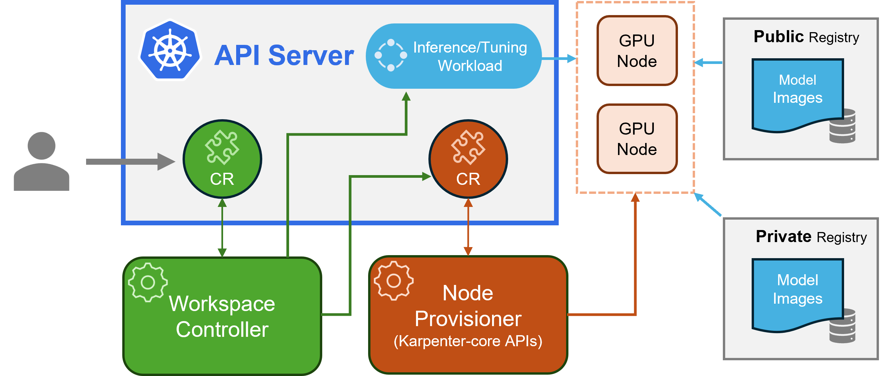

# Kubernetes AI Toolchain Operator (Kaito)


[](https://goreportcard.com/report/github.com/kaito-project/kaito)

[](https://codecov.io/gh/Azure/kaito)

|  What is NEW! |
|-------------------------------------------------|
| Latest Release: Dec 5th, 2024. Kaito v0.4.0.    |
| First Release: Nov 15th, 2023. Kaito v0.1.0.    |

Kaito is an operator that automates the AI/ML model inference or tuning workload in a Kubernetes cluster.
The target models are popular open-sourced large models such as [falcon](https://huggingface.co/tiiuae) and [phi-3](https://huggingface.co/docs/transformers/main/en/model_doc/phi3).
Kaito has the following key differentiations compared to most of the mainstream model deployment methodologies built on top of virtual machine infrastructures:

- Manage large model files using container images. An OpenAI-compatible server is provided to perform inference calls.
- Provide preset configurations to avoid adjusting workload parameters based on GPU hardware.
- Provide support for popular open-sourced inference runtimes: [vLLM](https://github.com/vllm-project/vllm) and [transformers](https://github.com/huggingface/transformers).
- Auto-provision GPU nodes based on model requirements.
- Host large model images in the public Microsoft Container Registry (MCR) if the license allows.

Using Kaito, the workflow of onboarding large AI inference models in Kubernetes is largely simplified.

## Architecture

Kaito follows the classic Kubernetes Custom Resource Definition(CRD)/controller design pattern. User manages a `workspace` custom resource which describes the GPU requirements and the inference or tuning specification. Kaito controllers will automate the deployment by reconciling the `workspace` custom resource.
<div align="left">
  
</div>

The above figure presents the Kaito architecture overview. Its major components consist of:

- **Workspace controller**: It reconciles the `workspace` custom resource, creates `machine` (explained below) custom resources to trigger node auto provisioning, and creates the inference or tuning workload (`deployment`, `statefulset` or `job`) based on the model preset configurations.
- **Node provisioner controller**: The controller's name is *gpu-provisioner* in [gpu-provisioner helm chart](https://github.com/Azure/gpu-provisioner/tree/main/charts/gpu-provisioner). It uses the `machine` CRD originated from [Karpenter](https://sigs.k8s.io/karpenter) to interact with the workspace controller. It integrates with Azure Resource Manager REST APIs to add new GPU nodes to the AKS or AKS Arc cluster.
> Note: The [*gpu-provisioner*](https://github.com/Azure/gpu-provisioner) is an open sourced component. It can be replaced by other controllers if they support [Karpenter-core](https://sigs.k8s.io/karpenter) APIs.

## Installation

Please check the installation guidance [here](./docs/installation.md) for deployment using Azure CLI and [here](./terraform/README.md) for deployment using Terraform.

## Quick start

After installing Kaito, one can try following commands to start a phi-3.5-mini-instruct inference service.

```sh
$ cat examples/inference/kaito_workspace_phi_3.5-instruct.yaml
apiVersion: kaito.sh/v1alpha1
kind: Workspace
metadata:
  name: workspace-phi-3-5-mini
resource:
  instanceType: "Standard_NC6s_v3"
  labelSelector:
    matchLabels:
      apps: phi-3-5
inference:
  preset:
    name: phi-3.5-mini-instruct

$ kubectl apply -f examples/inference/kaito_workspace_phi_3.5-instruct.yaml
```

The workspace status can be tracked by running the following command. When the WORKSPACEREADY column becomes `True`, the model has been deployed successfully.

```sh
$ kubectl get workspace workspace-phi-3-5-mini
NAME                     INSTANCE           RESOURCEREADY   INFERENCEREADY   JOBSTARTED   WORKSPACESUCCEEDED   AGE
workspace-phi-3-5-mini   Standard_NC6s_v3   True            True                          True                 4h15m
```

Next, one can find the inference service's cluster ip and use a temporal `curl` pod to test the service endpoint in the cluster.

```sh
# find service endpoint
$ kubectl get svc workspace-phi-3-5-mini
NAME                     TYPE        CLUSTER-IP   EXTERNAL-IP   PORT(S)            AGE
workspace-phi-3-5-mini   ClusterIP   <CLUSTERIP>  <none>        80/TCP,29500/TCP   10m
$ export CLUSTERIP=$(kubectl get svc workspace-phi-3-5-mini -o jsonpath="{.spec.clusterIPs[0]}")

# find availalbe models
$ kubectl run -it --rm --restart=Never curl --image=curlimages/curl -- curl -s  http://$CLUSTERIP/v1/models | jq
{
  "object": "list",
  "data": [
    {
      "id": "phi-3.5-mini-instruct",
      "object": "model",
      "created": 1733370094,
      "owned_by": "vllm",
      "root": "/workspace/vllm/weights",
      "parent": null,
      "max_model_len": 16384
    }
  ]
}

# make an inference call using the model id (phi-3.5-mini-instruct) from previous step
$ kubectl run -it --rm --restart=Never curl --image=curlimages/curl -- curl -X POST http://$CLUSTERIP/v1/completions \
  -H "Content-Type: application/json" \
  -d '{
    "model": "phi-3.5-mini-instruct",
    "prompt": "What is kubernetes?",
    "max_tokens": 7,
    "temperature": 0
  }'
```

## Usage

The detailed usage for Kaito supported models can be found in [**HERE**](presets/README.md). In case users want to deploy their own containerized models, they can provide the pod template in the `inference` field of the workspace custom resource (please see [API definitions](api/v1alpha1/workspace_types.go) for details). The controller will create a deployment workload using all provisioned GPU nodes. Note that currently the controller does **NOT** handle automatic model upgrade. It only creates inference workloads based on the preset configurations if the workloads do not exist.

The number of the supported models in Kaito is growing! Please check [this](./docs/How-to-add-new-models.md) document to see how to add a new supported model.

Starting with version v0.3.0, Kaito supports model fine-tuning and using fine-tuned adapters in the inference service. Refer to the [tuning document](./docs/tuning/README.md) and [inference document](./docs/inference/README.md) for more information.

## FAQ

### How do I ensure preferred nodes are correctly labeled for use in my workspace?

For using preferred nodes, make sure the node has the label specified in the labelSelector 
under matchLabels. For example, if your labelSelector is:
```
  labelSelector:
    matchLabels:
      apps: falcon-7b
```
Then the node should have the label: `apps=falcon-7b`.

### How to upgrade the existing deployment to use the latest model configuration?

When using hosted public models, a user can delete the existing inference workload (`Deployment` of `StatefulSet`) manually, and the workspace controller will create a new one with the latest preset configuration (e.g., the image version) defined in the current release. For private models, it is recommended to create a new workspace with a new image version in the Spec.

### How to update model/inference parameters to override the Kaito Preset Configuration?

Kaito provides a limited capability to override preset configurations for models that use `transformer` runtime manually.
To update parameters for a deployed model, perform `kubectl edit` against the workload, which could be either a `StatefulSet` or `Deployment`.
For example, to enable 4-bit quantization on a `falcon-7b-instruct` deployment, you would execute:

```sh
kubectl edit deployment workspace-falcon-7b-instruct
```

Within the deployment specification, locate and modify the command field.

#### Original

```sh
accelerate launch --num_processes 1 --num_machines 1 --machine_rank 0 --gpu_ids all inference_api.py --pipeline text-generation --torch_dtype bfloat16
```

#### Modify to enable 4-bit Quantization

```sh
accelerate launch --num_processes 1 --num_machines 1 --machine_rank 0 --gpu_ids all inference_api.py --pipeline text-generation --torch_dtype bfloat16 --load_in_4bit
```

Currently, we allow users to change the following paramenters manually:

- `pipeline`: For text-generation models this can be either `text-generation` or `conversational`.
- `load_in_4bit` or `load_in_8bit`: Model quantization resolution.

Should you need to customize other parameters, kindly file an issue for potential future inclusion.

### What is the difference between instruct and non-instruct models?

The main distinction lies in their intended use cases. Instruct models are fine-tuned versions optimized
for interactive chat applications. They are typically the preferred choice for most implementations due to their enhanced performance in
conversational contexts.
On the other hand, non-instruct, or raw models, are designed for further fine-tuning. 

## Contributing

[Read more](docs/contributing/readme.md)
<!-- markdown-link-check-disable -->
This project welcomes contributions and suggestions. The contributions require you to agree to a
Contributor License Agreement (CLA) declaring that you have the right to, and actually do, grant us
the rights to use your contribution. For details, visit [CLAs for CNCF](https://github.com/cncf/cla?tab=readme-ov-file).

When you submit a pull request, a CLA bot will automatically determine whether you need to provide
a CLA and decorate the PR appropriately (e.g., status check, comment). Simply follow the instructions
provided by the bot. You will only need to do this once across all repos using our CLA.

This project has adopted the CLAs for CNCF, please electronically sign the CLA via 
https://easycla.lfx.linuxfoundation.org. If you encounter issues, you can submit a ticket with the 
Linux Foundation ID group through the [Linux Foundation Support website](https://jira.linuxfoundation.org/plugins/servlet/desk/portal/4/create/143).

## License

See [MIT License](LICENSE).

## Code of Conduct

KAITO has adopted the [Cloud Native Compute Foundation Code of Conduct](https://github.com/cncf/foundation/blob/master/code-of-conduct.md). For more information see the [KAITO Code of Conduct](CODE_OF_CONDUCT.md).

<!-- markdown-link-check-enable -->
## Contact

"Kaito devs" <kaito-dev@microsoft.com>

[Kaito Community Slack](https://join.slack.com/t/kaito-z6a6575/shared_invite/zt-2wm17rttz-t4E6_rMIuY03DwBHaJq1sg)
