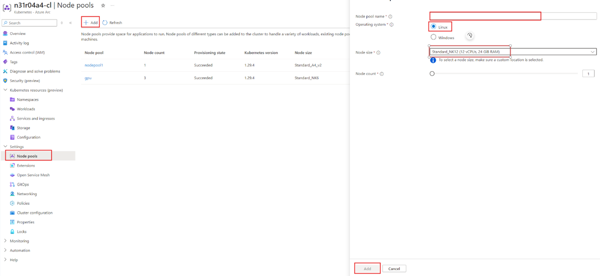

# Use Kaito in AKS Arc
This article describes how to deploy AI models on AKS arc with AI toolchain operator (KAITO). 

AKS Arc, or Azure Kubernetes Service (AKS) on Azure Arc, is a service that extends Azure management and governance capabilities to Kubernetes clusters running anywhere, whether on-premises, at the edge, or in other cloud environments. It allows you to manage and secure your Kubernetes clusters consistently across different environments using Azure tools and services.

Follow the workflow below to enable this feature.

## Supported Models
Currently KAITO supports models such as Falcon, Phi2, Phi3, Llama2, Llama2Chat, Mistral. Please refer to KAITO’s [readme](https://github.com/Azure/kaito/blob/main/presets/README.md) file for the latest models. 

## Prerequisite
1.	Before you begin, please make sure you have the following details from your infrastructure administrator:
    - An AKS Arc cluster that's up and running.
    - We recommend using Linux machine for this feature.
    - Your local kubectl environment configured to point to your AKS cluster.
        - Run `az aksarc get-credentials --resource-group <ResourceGroupName> --name <ClusterName>  --admin` to download the kubeconfig file.
2.	Make sure your Azure Local cluster is enabled with GPU, you can ask your infrastructure administrator to set it up for you. You also need to identify the right VM SKUs for your AKS cluster before creating the node pool. The instruction can be found at [use GPU for compute-intensive workloads](https://learn.microsoft.com/en-us/azure/aks/hybrid/deploy-gpu-node-pool).
3.	Make sure the helm and kubectl are installed in your local machine.
    - If you need to install or upgrade, please see instruction from [Install Helm](https://helm.sh/docs/intro/install/).
    - If you need to install kubectl, please see instructions from [Install kubectl](https://kubernetes.io/docs/tasks/tools/install-kubectl/).

## Create a GPU Node Pool
Available GPU sku can be found [here](https://learn.microsoft.com/en-us/azure/aks/hybrid/deploy-gpu-node-pool#supported-vm-sizes)
<details>
<summary><b>Using Azure Portal</b></summary>
<div align="middle">
  
</div>
</details>

<details>
<summary><b>Using Az CLI</b></summary>
<div align="middle">
Run following Az command to provision node pool

```bash
az aksarc nodepool add --name "samplenodepool" --cluster-name "samplecluster" --resource-group "sample-rg" –node-vm-size "samplenodepoolsize" –os-type "Linux"
```

</div>
</details>

### Validation
<details>
<summary><b>Explain the get node command</b></summary>
The node created will have random name in format moc-&lt;random&gt;, and will have the following label to reference its nodepool: msft.microsoft/nodepool-name = &lt;culsterName&gt;-&lt;randon&gt;-&lt;nodepoolName&gt;. 

This command is to check the node whoes label can pass the regex and print its name
</details>

1.	After node pool creation command succeeds, you can confirm whether the GPU node is provisioned using following command, replace `<clusterName>` and `<nodepoolName>` with real value.
```bash
kubectl get nodes -o json | jq -r '.items[] | select(.metadata.labels["msft.microsoft/nodepool-name"] != null and (.metadata.labels["msft.microsoft/nodepool-name"] | tostring | test("^<culsterName>-.*-<nodepoolName>$"))) | .metadata.name'
```

2.	Please also ensure the node has allocatable GPU cores using command 
```bash
kubectl get node moc-l1i9uh0ksne -o yaml | grep -A 10 "allocatable:"
```
```
  allocatable:
    cpu: 31580m
    ephemeral-storage: "95026644016"
    hugepages-1Gi: "0"
    hugepages-2Mi: "0"
    memory: 121761176Ki
    nvidia.com/gpu: "2"
    pods: "110"
  capacity:
    cpu: "32"
    ephemeral-storage: 103110508Ki
```

## Deploy KAITO via Helm

> User does not need to install the gpu-provisioner as the node will be provisioned manually.
1.	Git clone the KAITO repo to your local machine
2.	Install KAITO operator using command 
```bash
helm install workspace ./charts/kaito/workspace --namespace kaito-workspace --create-namespace
```

## Deploy LLM Model
<details>
<summary><b>Explain the Yaml file</b></summary>
If a user runs Kaito in an on-premise Kubernetes cluster where nodepool auto provision are unavailable, the GPU nodes can be <a href="#create-a-gpu-node-pool">pre-configured</a>.

- the user needs to add the node names in the `preferredNodes` field in the `resource` spec. As a result, the Kaito controller will skip the steps for GPU node provisioning and use the prepared nodes to run the inference workload.


Using the same method user can try all kaito functionalities, example can be found on /examples folder.
</details>

1.	Create a YAML file with the following template, make sure to replace the placeholders in curly braces with your own information. Please note, the PresetName can be found from the supported model file in KAITO’s github repo.
```yaml
apiVersion: kaito.sh/v1alpha1
kind: Workspace
metadata:
  name: { YourDeploymentName }
resource:
  labelSelector:
    matchLabels:
      apps: { YourNodeLabel }
  preferredNodes:
  - { YourNodeName }
inference:
  preset:
    name: { PresetName }

```
a sample yaml file can be 
```yaml
apiVersion: kaito.sh/v1alpha1
kind: Workspace
metadata:
  name: workspace-falcon-7b
resource:
  labelSelector:
    matchLabels:
      apps: falcon-7b
  preferredNodes: 
  - moc-lmkq7webq9z
inference:
  preset:
    name: falcon-7b-instruct
```
2.	You need to label your GPU node first, `Kubectl label node samplenode apps=YourNodeLabel` and then apply the YAML file
`kubectl apply -f sampleyamlfile.yaml`

 

## Validate model deployment 
1.	Validate the workspace using the command `kubectl get workspace`. Please also make sure both `ResourceReady` and `InferenceReady` fields are True before testing with the sample prompt.
```
NAME                           INSTANCE           RESOURCEREADY   INFERENCEREADY   JOBSTARTED   WORKSPACESUCCEEDED   AGE
workspace-falcon-7b            Standard_NC6s_v3   True            True                          True                 4d
```

2.	You may test the model with a sample prompt: 
```bash
export CLUSTERIP=$(kubectl get svc workspace-falcon-7b -o jsonpath="{.spec.clusterIPs[0]}") 

kubectl run -it --rm --restart=Never curl --image=curlimages/curl -- curl -X POST http://$CLUSTERIP/chat -H "accept: application/json" -H "Content-Type: application/json" -d "{\"prompt\":\"<sample_prompt>\"}"
```
a sample output will be like
```bash
$ kubectl run -it --rm --restart=Never curl --image=curlimages/curl -- curl -X POST http://$CLUSTERIP/chat -H "accept: application/json" -H "Content-Type: application/json" -d "{\"prompt\":\"write a poem\"}"
If you don't see a command prompt, try pressing enter.
{"Result":"write a poem about the first day of school, the last day of school, or a day in school.\nThe first day of school\nI wake at dawn\nand think of the new day\nas the sun rises\nI am excited\nthe first day of school\nI wake at dawn\nand think of the new day\nas the sun rises\nI am excited\nthe last day of school\nI wake at dawn\nand think of the last day\nas the sun rises\nI am sad\nthe last day of school\nI wake at dawn\nand think of the last day\nas the sun rises\nI am sad\na day in school\nthe first day of school\nI wake at dawn\nand think of the new day\nas the sun rises\nI am excited\nthe last day of school\nI wake at dawn\nand think of the last day\nas the sun rises\nI am sad\na day in school\nI walk down the stairs"}pod "curl" deleted
```