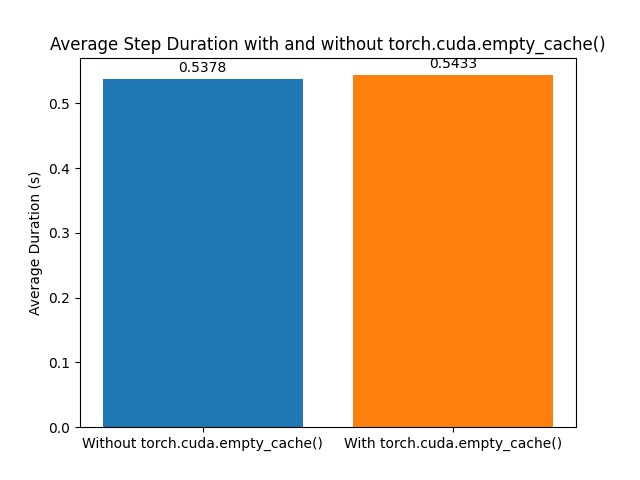

## OOM Troubleshooting

### Gathering Debug Information
1. Set CUDA Environment Variables:
   - `CUDA_LAUNCH_BLOCKING=1`: Forces synchronous CUDA kernel launches to provide detailed error information and help pinpoint failures.
      - Pros & Cons: Useful for debugging, but may reduce performance, so it's not recommended for production environments.
   - Reduce GPU Memory Fragmentation by setting:
      - `PYTORCH_CUDA_ALLOC_CONF=expandable_segments:True` and
      - `PYTORCH_CUDA_ALLOC_CONF=max_split_size_mb:512`: Optimize memory allocation to prevent OOM errors. Start with 512 MB and adjust as needed.
   - How to Set: Add these to the container's environment variables or update the deployment container command. If the new pod gets stuck in a pending state, either delete the running pod to prioritize the rollout or scale the deployment down to zero and back up:
      ```
      kubectl scale deployment <deployment-name> --replicas=0
      kubectl scale deployment <deployment-name> --replicas=1
      ```

## Tuning
Debugging GPU OOM (Out of Memory) issues during the fine-tuning process involves several strategies. Here are some steps to help you resolve these issues:


### Preliminary Steps
If setting environment variables doesn't resolve the issue, consider these steps:
1. Reduce Batch Size: 
   - The default batch size is set to the smallest size of 1. If you haven't modified this, you are already using the minimum batch size.
2. Enable QLoRa (Quantization)
   - Refer to `../charts/kaito/templates/qlora-params.yaml` for an example. (TODO: example GRaph)
3. Truncation and Padding
   - Truncation reduces data sample sizes, which can help prevent OOM errors. For more information, refer to [Hugging Face's documentation on padding and truncation](https://huggingface.co/docs/transformers/en/pad_truncation).

There are several ways to go about debugging GPU OOM issues during the fine-tuning process. 


### Observing and Adjusting the Dataset

If issues persist, examine your tuning dataset for outliers:
- For example see this dataset below 
- Identify and filter out larger data samples that may be causing OOM issues.
- Consider truncating data samples to manage their size.

### Memory Management

In Kaito, we call torch.cuda.empty_cache() at every tuning step to prevent OOM errors. Here’s an experiment demonstrating the impact of this approach:

1. Memory Usage Over Time:
   - Running a tuning job for Phi-3 on an A100 GPU shows memory usage patterns. 
2. Effect of Clearing Cache: 
   - Clearing the cache at every step significantly improves memory management. 
3. Detailed View: 
   - A closer look reveals the correlation between reserved memory and batch content size. 

### Performance Consideration 
Clearing the cache at every step introduces minimal performance overhead:


Given the minimal performance penalty, it is acceptable to call `torch.cuda.empty_cache()` at every step to manage memory and prevent OOM errors effectively.


## Inference

### Strategies
If setting environment variables doesn't resolve the issue, consider these additional steps:

1. Reducing context length:
   - While reducing context length has a minimal effect on GPU memory usage, it significantly reduces inference time. 
   Use `max_new_tokens` or `max_length` (input prompt + `max_new_tokens`) to control the length of your response. 
   Note that `max_length` is capped at the `context_length` of your model.

2. Enable Quantization 
   - Implement model quantization to manage memory usage. For details, refer to the [Quantization Section](https://github.com/Azure/kaito/blob/main/README.md#modify-to-enable-4-bit-quantization) 
   in the Kaito README. Use load_in_4bit or load_in_8bit to set the model quantization resolution.
