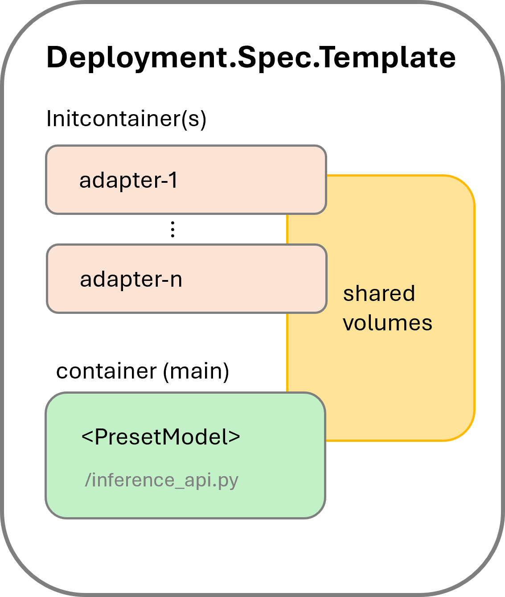

# Kaito Inference

This document presents how to use the Kaito `workspace` Custom Resource Definition (CRD) for model serving and serving with LoRA adapters.

## Usage

The basic usage for inference is simple. Users just need to specify the GPU SKU used for inference in the `resource` spec and one of the Kaito supported model name in the `inference` spec in the `workspace` custom resource. For example,

```yaml
apiVersion: kaito.sh/v1alpha1
kind: Workspace
metadata:
  name: workspace-falcon-7b
resource:
  instanceType: "Standard_NC6s_v3"
  labelSelector:
    matchLabels:
      apps: falcon-7b
inference:
  preset:
    name: "falcon-7b"
```

If a user runs Kaito in an on-premise Kubernetes cluster where GPU SKUs are unavailable, the GPU nodes can be pre-configured. The user should ensure that the corresponding vendor-specific GPU plugin is installed successfully in every prepared node, i.e. the node status should report a non-zero GPU resource in the allocatable field. For example:

```
$ kubectl get node $NODE_NAME -o json | jq .status.allocatable
{
  "cpu": "XXXX",
  "ephemeral-storage": "YYYY",
  "hugepages-1Gi": "0",
  "hugepages-2Mi": "0",
  "memory": "ZZZZ",
  "nvidia.com/gpu": "1",
  "pods": "100"
}
```

Next, the user needs to add the node names in the `preferredNodes` field in the `resource` spec. As a result, the Kaito controller will skip the steps for GPU node provisioning and use the prepared nodes to run the inference workload.
> [!IMPORTANT]
> The node objects of the preferred nodes need to contain the same matching labels as specified in the `resource` spec. Otherwise, the Kaito controller would not recognize them.

### Inference runtime selection

KAITO now supports both [vLLM](https://github.com/vllm-project/vllm) and [transformers](https://github.com/huggingface/transformers) runtime. `vLLM` provides better serving latency and throughput. `transformers` provides more compatibility with models in the Huggingface model hub.

From KAITO v0.4.0, the default runtime is switched to `vLLM`. If you want to use `transformers` runtime, you can specify the runtime in the `inference` spec using an annotation. For example,

```yaml
apiVersion: kaito.sh/v1alpha1
kind: Workspace
metadata:
  name: workspace-falcon-7b
  annotations:
    kaito.sh/runtime: "transformers"
resource:
  instanceType: "Standard_NC12s_v3"
  labelSelector:
    matchLabels:
      apps: falcon-7b
inference:
  preset:
    name: "falcon-7b"
```

### Inference with LoRA adapters 

Kaito also supports running the inference workload with LoRA adapters produced by [model fine-tuning jobs](../tuning/README.md). Users can specify one or more adapters in the `adapters` field of the `inference` spec. For example,

```yaml
apiVersion: kaito.sh/v1alpha1
kind: Workspace
metadata:
  name: workspace-falcon-7b
resource:
  instanceType: "Standard_NC12s_v3"
  labelSelector:
    matchLabels:
      apps: falcon-7b
inference:
  preset:
    name: "falcon-7b"
  adapters:
    - source:
        name: "falcon-7b-adapter"
        image:  "<YOUR_IMAGE>"
      strength: "0.2"
```
Currently, only images are supported as adapter sources. The `strength` field specifies the multiplier applied to the adapter weights relative to the raw model weights.

**Note:** When building a container image for an existing adapter, ensure all adapter files are copied to the **/data** directory inside the container.

For detailed `InferenceSpec` API definitions, refer to the [documentation](https://github.com/kaito-project/kaito/blob/2ccc93daf9d5385649f3f219ff131ee7c9c47f3e/api/v1alpha1/workspace_types.go#L75).

### Inference API

The OpenAPI specification for the inference API is available at [vLLM API](../../presets/workspace/inference/vllm/api_spec.json), [transformers API](../../presets/workspace/inference/text-generation/api_spec.json).

#### vLLM inference API

vLLM supports OpenAI-compatible inference APIs. Check [here](https://docs.vllm.ai/en/stable/serving/openai_compatible_server.html) for more details.

#### Transformers inference API

The inference service endpoint is `/chat`.

**basic example**
```
curl -X POST "http://<SERVICE>:80/chat" -H "accept: application/json" -H "Content-Type: application/json" -d '{"prompt":"YOUR_PROMPT_HERE"}'
```

**example with full configurable parameters**
```
curl -X POST \
    -H "accept: application/json" \
    -H "Content-Type: application/json" \
    -d '{
        "prompt":"YOUR_PROMPT_HERE",
        "return_full_text": false,
        "clean_up_tokenization_spaces": false,
        "prefix": null,
        "handle_long_generation": null,
        "generate_kwargs": {
                "max_length":200,
                "min_length":0,
                "do_sample":true,
                "early_stopping":false,
                "num_beams":1,
                "num_beam_groups":1,
                "diversity_penalty":0.0,
                "temperature":1.0,
                "top_k":10,
                "top_p":1,
                "typical_p":1,
                "repetition_penalty":1,
                "length_penalty":1,
                "no_repeat_ngram_size":0,
                "encoder_no_repeat_ngram_size":0,
                "bad_words_ids":null,
                "num_return_sequences":1,
                "output_scores":false,
                "return_dict_in_generate":false,
                "forced_bos_token_id":null,
                "forced_eos_token_id":null,
                "remove_invalid_values":null
            }
        }' \
        "http://<SERVICE>:80/chat"
```

**parameters**
- `prompt`: The initial text provided by the user, from which the model will continue generating text.
- `return_full_text`: If False only generated text is returned, else full text is returned.
- `clean_up_tokenization_spaces`: True/False, determines whether to remove potential extra spaces in the text output.
- `prefix`: Prefix added to the prompt.
- `handle_long_generation`: Provides strategies to address generations beyond the model's maximum length capacity.
- `max_length`: The maximum total number of tokens in the generated text.
- `min_length`: The minimum total number of tokens that should be generated.
- `do_sample`: If True, sampling methods will be used for text generation, which can introduce randomness and variation.
- `early_stopping`: If True, the generation will stop early if certain conditions are met, for example, when a satisfactory number of candidates have been found in beam search.
- `num_beams`: The number of beams to be used in beam search. More beams can lead to better results but are more computationally expensive.
- `num_beam_groups`: Divides the number of beams into groups to promote diversity in the generated results.
- `diversity_penalty`: Penalizes the score of tokens that make the current generation too similar to other groups, encouraging diverse outputs.
- `temperature`: Controls the randomness of the output by scaling the logits before sampling.
- `top_k`: Restricts sampling to the k most likely next tokens.
- `top_p`: Uses nucleus sampling to restrict the sampling pool to tokens comprising the top p probability mass.
- `typical_p`: Adjusts the probability distribution to favor tokens that are "typically" likely, given the context.
- `repetition_penalty`: Penalizes tokens that have been generated previously, aiming to reduce repetition.
- `length_penalty`: Modifies scores based on sequence length to encourage shorter or longer outputs.
- `no_repeat_ngram_size`: Prevents the generation of any n-gram more than once.
- `encoder_no_repeat_ngram_size`: Similar to `no_repeat_ngram_size` but applies to the encoder part of encoder-decoder models.
- `bad_words_ids`: A list of token ids that should not be generated.
- `num_return_sequences`: The number of different sequences to generate.
- `output_scores`: Whether to output the prediction scores.
- `return_dict_in_generate`: If True, the method will return a dictionary containing additional information.
- `pad_token_id`: The token ID used for padding sequences to the same length.
- `eos_token_id`: The token ID that signifies the end of a sequence.
- `forced_bos_token_id`: The token ID that is forcibly used as the beginning of a sequence token.
- `forced_eos_token_id`: The token ID that is forcibly used as the end of a sequence when max_length is reached.
- `remove_invalid_values`: If True, filters out invalid values like NaNs or infs from model outputs to prevent crashes.

# Inference workload

Depending on whether the specified model supports distributed inference or not, the Kaito controller will choose to use either Kubernetes **apps.deployment** workload (by default) or Kubernetes **apps.statefulset** workload (if the model supports distributed inference) to manage the inference service, which is exposed using a Cluster-IP type of Kubernetes `service`.

When adapters are specified in the `inference` spec, the Kaito controller adds an initcontainer for each adapter in addition to the main container. The pod structure is shown in Figure 1.

<div align="left">
  
</div>

If an image is specified as the adapter source, the corresponding initcontainer uses that image as its container image. These initcontainers ensure all adapter data is available locally before the inference service starts. The main container uses a supported model image, launching the [inference_api.py](../../presets/workspace/inference/text-generation/inference_api.py) script.

All containers share local volumes by mounting the same `EmptyDir` volumes, avoiding file copies between containers.

## Workload update

To update the `adapters` field in the `inference` spec, users can modify the `workspace` custom resource. The Kaito controller will apply the changes, triggering a workload deployment update. This will recreate the inference service pod, resulting in a brief service downtime. Once the new adapters are merged with the raw model weights and loaded into GPU memory, the service will resume.


# Troubleshooting

TBD
