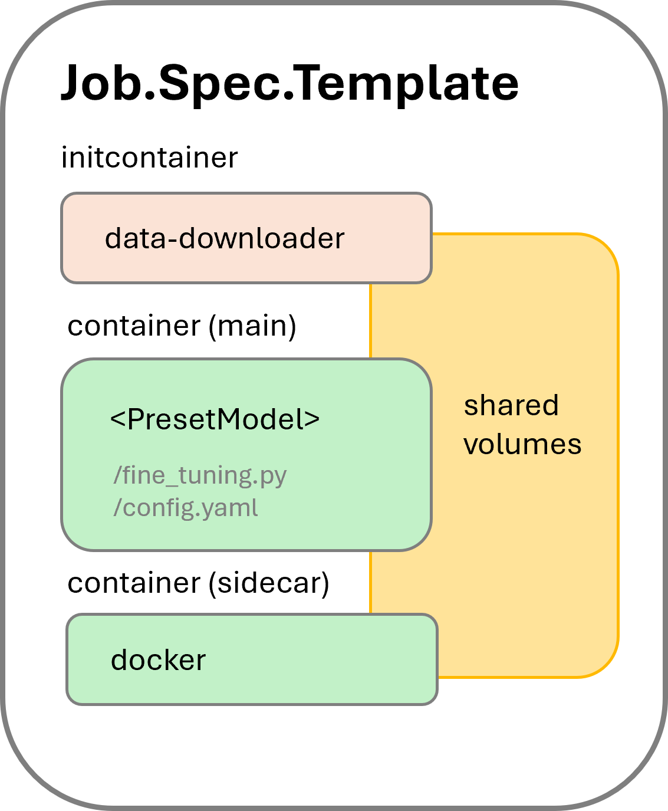

# Kaito fine tuning
This document presents how to use the Kaito `workspace` Custom Resource Definition (CRD) for parameter-efficient fine-tuning (PEFT) of models, how a Kubernetes job is designed to automate the tuning workflow, and several best practices for troubleshooting.

## Usage
Kaito tuning APIs allow users to specify supported tuning methods like [LoRA or QLoRA](https://huggingface.co/docs/peft/main/en/conceptual_guides/lora), the input dataset and configuration settings, and the output destination for saving the tuning results. Currently, Kaito supports both URL and image as the types of tuning input sources. It only supports image as the type of output destination. In the future, Kaito will additionally support the Kubernetes `v1.Volume` API for both the input source and the output destination.


### Tuning workspace
Here are two examples of using Kaito workspace CRD to define workspaces for tuning different models:

Example 1: Tuning [`phi-3-mini`](../../examples/fine-tuning/kaito_workspace_tuning_phi_3.yaml). This example uses a public dataset specified by a URL in the input.

Example 2: Tuning `falcon-7b`. This example shows how to use an image as the source of input data.
```yaml
apiVersion: kaito.sh/v1alpha1
kind: Workspace
metadata:
  name: workspace-tuning-falcon
resource:
  instanceType: "Standard_NC24ads_A100_v4"
  labelSelector:
    matchLabels:
      app: tuning-falcon
tuning:
  preset:
    name: falcon-7b
  method: qlora
  input:
    image: PULLREGISTRY/DATA_NAME_HERE:0.0.1
    imagePullSecrets:
      - IMAGE_PULL_SECRETS_HERE
  output:
    image: PUSHREGISTRY/ADAPTER_NAME_HERE:0.0.1  # Tuning Output
    imagePushSecret: IMAGE_PUSH_SECRET_HERE

```

The detailed `TuningSpec` API definitions can be found [here](https://github.com/kaito-project/kaito/blob/2ccc93daf9d5385649f3f219ff131ee7c9c47f3e/api/v1alpha1/workspace_types.go#L145).

### Tuning configurations
Kaito provides default tuning configurations for different tuning methods. They are managed by Kubernetes configmaps.
- [default LoRA configmap](../../charts/kaito/workspace/templates/lora-params.yaml)
- [default QLoRA configmap](../../charts/kaito/workspace/templates/qlora-params.yaml)

## Tuning configmaps
User can specify a customized configmap via the `Config` field of the `TuningSpec`. The customized configmap should be structured based on the default configmaps provided by Kaito. Please read the following section carefully when attempting to change the default parameters used by Kaito.

### Categorized key parameters
Note that changing these parameters may largely impact the tuning result. In addition, users can add extra parameters that are not presented in the default configmaps. For a complete list of supported parameters, please refer to the provided huggingface documentation.

ModelConfig([full list](https://huggingface.co/docs/transformers/v4.40.2/en/model_doc/auto#transformers.AutoModelForCausalLM.from_pretrained))
- torch_dtype: Specifies the data type for PyTorch tensors, e.g., "bfloat16".
- local_files_only: Indicates whether to only use local files.
- device_map: Configures device mapping for the model, typically "auto".

QuantizationConfig([full list](https://huggingface.co/docs/transformers/v4.40.2/en/main_classes/quantization#transformers.BitsAndBytesConfig))
- load_in_4bit: Enables loading the model with 4-bit precision.
- bnb_4bit_quant_type: Specifies the type of 4-bit quantization, e.g., "nf4".
- bnb_4bit_compute_dtype: Data type for computation, e.g., "bfloat16".
- bnb_4bit_use_double_quant: Enables double quantization.

LoraConfig([full list](https://huggingface.co/docs/peft/v0.8.2/en/package_reference/lora#peft.LoraConfig))
- **r**: Rank of the low-rank matrices used in LoRA.
- lora_alpha: Scaling factor for LoRA.
- lora_dropout: Dropout rate for LoRA layers.

TrainingArguments([full list](https://huggingface.co/docs/transformers/v4.40.2/en/main_classes/trainer#transformers.TrainingArguments))
- ddp_find_unused_parameters: Flag to handle unused parameters during distributed training.
- save_strategy: Strategy for saving checkpoints, e.g., "epoch".
- per_device_train_batch_size: Batch size per device during training.
- num_train_epochs: Total number of training epochs to perform, defaults to 3.0.

DataCollator([full list](https://huggingface.co/docs/transformers/v4.40.2/en/main_classes/data_collator#transformers.DataCollatorForLanguageModeling))
- mlm: Masked language modeling flag.

DatasetConfig([full list](https://github.com/kaito-project/kaito/blob/main/presets/workspace/tuning/text-generation/cli.py#L44))
- shuffle_dataset: Whether to shuffle the dataset.
- train_test_split: Proportion of data used for training, typically set to 1 for using all data.

## Input dataset format
The input dataset for fine-tuning should follow specific formats defined in the HuggingFace trainer library. Supported formats include conversational and instruction formats.

For example, [HuggingFace Dolly 15k OAI-style dataset](https://huggingface.co/datasets/philschmid/dolly-15k-oai-style/tree/main)

- Conversational format
  ```json
  {
    "messages": [
      {"role": "system", "content": "Marv is a factual chatbot that is also sarcastic."},
      {"role": "user", "content": "What's the capital of France?"},
      {"role": "assistant", "content": "Paris, as if everyone doesn't know that already."}
    ]
  }
  ```

For example, [HuggingFace Instruction Dataset](https://huggingface.co/datasets/HuggingFaceH4/instruction-dataset/tree/main)

- Instruction format
  ```json
  {"prompt": "<prompt text>", "completion": "<ideal generated text>"}
  ```

If your dataset is not in one of these formats, it will be passed directly to the training library ([SFTTrainer](https://huggingface.co/docs/trl/en/sft_trainer)) without any preprocessing. This may result in undefined behavior if the dataset does not align with the trainer's expected input structure. To ensure proper functionality, you may need to preprocess the dataset to match one of the supported formats. For more details, please refer to this [documentation](https://huggingface.co/docs/trl/v0.9.4/sft_trainer#dataset-format-support).


Note: if you build a container image for the input dataset, please copy the dataset to the **`/data`** directory inside the container.

# Tuning Job
Kaito uses the Kubernetes **batchv1.job** workload to manage the tuning Pod. When a tuning workspace custom resource is created, the Kaito controller will create a job with the same name as the workspace in the same namespace. To streamline the tuning workflow, Kaito adds two containers in addition to the main container that runs the tuning process. The pod structure is illustrated in Figure 1.
<div align="left">
  
</div>
Figure 1. Kaito tuning pod structure.

- Initcontainer `data-downloader`: It downloads the training input dataset from the URLs specified in the tuning spec if needed. If an image is specified in the input, the `data-downloader` container uses the specified image as the container image. This initcontainer ensures the training data is available locally before the training process starts.

- Sidecar container: It is introduced to support automatically pushing the tuning results to a container registry. This container, with `docker` installed, runs a script to periodically check the training progress. Once the training is done, indicated by a sentinel file created by the training process, the script builds a container image containing the training results and pushes the image to the specified container registry.

- Main container: It uses one of the supported model images. The image entry launches the [fine\_tuning.py](https://github.com/kaito-project/kaito/blob/main/presets/workspace/tuning/text-generation/fine_tuning.py) script.

All three containers use shared local volumes (by mounting the same `EmptyDir` volumes), hence file copies between containers are avoided.

# Troubleshooting

### Job pod failures
When the tuning job reaches the failed state, at least one of the above three containers has encountered errors. Users can check the logs of these containers using the `kubectl logs PODNAME -n NAMESPACE -c CONTAINERNAME` command.

For the initcontainer and sidecar container, possible errors include invalid input/output URLs or invalid image pull secrets. Users can fix these problems by updating the workspace custom resource with corrections. The Kaito controller will create a new job using the updated spec.

For the main container, errors may occur when CUDA reports out of GPU memory. Users should reduce the batch size (the default is 1) if it has been customized to a value larger than 1. If the batch size is already 1, the workspace must be recreated using a different GPU SKU with larger GPU memory. Note that Kaito has optimized the training memory usage by dropping the preallocated memory cache. Our internal tests show that the performance impact due to this change is negligible.

### Time for job completion
The training job can take a long time depending on the size of the input dataset and training pipeline configurations. The total training time is largely determined by the total number of training steps, calculated as:
```
total steps = number of epochs * (number of samples in dataset / batch size)
```
where `number of epochs` and `batch size` can be customized in the tuning configmap. However, if the `max_steps` parameter is also specified in the configmap, training will stop after reaching the max steps, even if the specified epochs have not been completed. Users can track the tuning progress in the job pod's log, reported by the number of steps completed out of the total.

Please file issues if you experience abnormal slowness of the training job.
